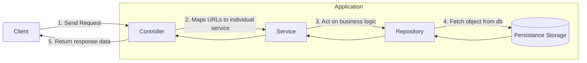

# Event Service

### Table of Contents

- [Folder Structure](#folder-structure)
- [Description](#description)
- [Application Block diagram](#diagram)
- [ID Generation Strategy](#id-generation-strategy)

<a name="folder-structure"></a>
### Folder Structure
```shell
.
├── Dockerfile
├── README.md
├── api
│   └── v1
│       ├── controllers
│       └── routes.go
├── app
│   ├── app.go
│   └── routes.go
├── config
│   └── date_format.go
├── db
│   └── postgres.go
├── dto
│   ├── db.go
│   ├── errors.go
│   └── event.go
├── filters
│   └── event_filter_impl.go
├── go.mod
├── go.sum
├── interfaces
│   ├── controllers
│   │   └── event_controller_interface.go
│   ├── db
│   │   └── db_interface.go
│   ├── filters
│   │   └── event.go
│   ├── models
│   │   └── models.go
│   ├── repository
│   │   └── event_repository_interface.go
│   └── services
│       └── event_service_interface.go
├── main.go
├── models
│   └── event.go
├── repository
│   └── event_repository_impl.go
├── services
│   └── event_service_impl.go
└── utils
    ├── hash_utils.go
    └── os_utils.go
```

<a name="description"></a>
### Description

* This service starts from `main.go`. Generally I try to keep this file short. I actually calls a function `app.StartApp()` which takes care of the configurations and setting up application routes.

* In `app/app.go` in function `StartApp()` first we setup the database connectivity. I do it centrally otherwise everytime 
  I need to setup a repository connection multiple connection would start. In keeping this centralized gives me the ability to shut down the connection gracefully when the application exits.

* In the later part of `app.StartApp()` we setup the application routes. I love modularizing codes so I keep all this configs 
separately to every file so that my application follows `Single Responsiblity Principle(SRP)`. We also inject the `db` connection 
dependency so that we can have the connection when we initialize the repository.

The whole application follows the clean code architecture. The block diagram is as follows:

<a name="diagram"></a>
**The code diagram might be ugly(generated by mermaid)**



* In `app/routes.go` we see function `ConfigureAppRoutes` collects all the subgroup of api routes from different module and return a `*gin.Engine` object to run the server.

* As we know it's very trivial to introduce versioning in the REST api format. So we have introduced versioning for controller and routes. The `v1` route for this event service is coming from `api/v1/routes.go`.

* In `api/v1/routes.go` we initialized the `repository` instances by injecting the `db` connection. And similarly we also injected `repository` and `service` in`service` and `controller` respectively.  I thought rather than declaring `db`, `repository`,  `services` and `controller` at a central place, this would be a good place for it as this will break the applications while building.

* We have a large `interfaces` folder where all the interfaces regarding controller, services, repos, models and others are kept in their respective folder. This will help us to understand the architecture of different classes and also mocking different objects during testing.

*  Apart from that we have our own `services`, `repository` and `controllers` folders which has the implementation of this interfaces that are defined inside the `interfaces` folder.

* We also have a `dto` folder which contains the definitions for the Data transfer objects mostly used for input validation and output responses.

* `config` folder contains different application specific configuration

* `utils` folder contains files that contains different string and hashing common functionality.

* `db` folder contains all the codes for initialization of different database services.

* `go.mod` contains the dependency of this micro service.

* `Dockerfile` contains the instruction for building an image from this application.

<a name="id-generation"></a>
### ID Generation Strategy

`ID` has been one of the most common way for developers to communicate. Like

`Hey, can you see what wrong with order #123?`

So for me, `ID` should be very expressive in nature not just an random string or `UUID`. It should be small but enough to have some heads-up on those information.

In this application have thought of the `ID` format like this
```
First 3 chars of env-first 3 chars of component - YYYYMMDDHHmmss-hash id with nanosecond of creation timestamp
```
Let's say we are creating an event of `production` environment coming from `orders` component at May 05, 2021 at 3:45pm 54 secs. The ID of it would be something similar to
```
pro-ord-20210505144554-(random-hash)
```
The `id` remains very expressive.  By looking at I can easily say that this might happen around this time with this and this params. Otherwise every dev would copy the long id and query the db then get the information and analyze.


**So what's with the random-hash part?**

One of leading question was how to handle system with hundreds of activity coming to the service. If we remove the `random-hash` part we could easily handle one event entry per second and that would suffice. But adding 100 or more in one second is tricky. So I thought of hashing the `nanosecond` part of it using `hashid` package from go to generate a small random string which ensures the uniqueness of the our event entry. On top of that, we can have unique hash for more than `10^9` possible scenarios.

**Code for generating the ID**
```go
func (e *Event) GenerateId() *string {  
   environment := strings.ToLower(e.Environment)[:3]  
   component := strings.ToLower(e.Component)[:3]  
   currentTime := time.Now()  
   timestamp := currentTime.Format(config.TIMESTAMP_FORMAT_ID)  
   id := strings.Join([]string{environment, component, timestamp, utils.GenerateHash(currentTime.Nanosecond(), 3)}, "-")  
   return &id  
}
```