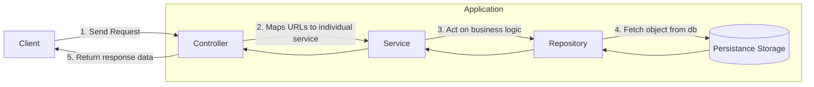

# Event Service


### Folder Structure
```shell
.
├── Dockerfile
├── README.md
├── api
│   └── v1
│       ├── controllers
│       └── routes.go
├── app
│   ├── app.go
│   └── routes.go
├── config
│   └── date_format.go
├── db
│   └── postgres.go
├── dto
│   ├── db.go
│   ├── errors.go
│   └── event.go
├── filters
│   └── event_filter_impl.go
├── go.mod
├── go.sum
├── interfaces
│   ├── controllers
│   │   └── event_controller_interface.go
│   ├── db
│   │   └── db_interface.go
│   ├── filters
│   │   └── event.go
│   ├── models
│   │   └── models.go
│   ├── repository
│   │   └── event_repository_interface.go
│   └── services
│       └── event_service_interface.go
├── main.go
├── models
│   └── event.go
├── repository
│   └── event_repository_impl.go
├── services
│   └── event_service_impl.go
└── utils
    ├── hash_utils.go
    └── os_utils.go
```

### Description

* This service starts from `main.go`. Generally I try to keep this file short. I actually calls a function `app.StartApp()` which takes care of the configurations and setting up application routes.

* In `app/app.go` in function `StartApp()` first we setup the database connectivity. I do it centrally otherwise everytime 
  I need to setup a repository connection multiple connection would start. In keeping this centralized gives me the ability to shut down the connection gracefully when the application exits.

* In the later part of `app.StartApp()` we setup the application routes. I love modularizing codes so I keep all this configs 
separately to every file so that my application follows `Single Responsiblity Principle(SRP)`. We also inject the `db` connection 
dependency so that we can have the connection when we initialize the repository.

The whole application follows the clean code architecture. The block diagram is as follows:

**The code diagram might be ugly(generated by mermaid)**



* In `app/routes.go` we see function `ConfigureAppRoutes` collects all the subgroup of api routes from different module and return a `*gin.Engine` object to run the server.

* As we know it's very trivial to introduce versioning in the REST api format. So we have introduced versioning for controller and routes. The `v1` route for this event service is coming from `api/v1/routes.go`.

* In `api/v1/routes.go` we initialized the `repository` instances by injecting the `db` connection. And similarly we also injected `repository` and `service` in`service` and `controller` respectively.  I thought rather than declaring `db`, `repository`,  `services` and `controller` at a central place, this would be a good place for it as this will break the applications while building.

* We have a large `interfaces` folder where all the interfaces regarding controller, services, repos, models and others are kept in their respective folder. This will help us to understand the architecture of different classes and also mocking different objects during testing.

*  Apart from that we have our own `services`, `repository` and `controllers` folders which has the implementation of this interfaces that are defined inside the `interfaces` folder.
