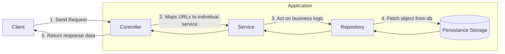

# Event Service

### Table of Contents

- [Folder Structure](#folder-structure)
- [Description](#description)
- [Application Block diagram](#diagram)
- [ID Generation Strategy](#id-generation-strategy)
- [Separation of concern](#separation-of-concern)
- [Business Logic Implementation](#business-logic-implementation)
- [Future business Logic Implementation](#future-business-logic-implementation)
- [Testing Strategy](#testing-strategy)
- [Handling high volume traffic](#handing-high-volume-traffic)
- [Data writing strategy](#data-writing-strategy)

## TL;DR
This documentation is a bit long. Please have patience! 

Please also note that we have implemented gRPC after the application is already designed with GIN web framework. 
So some of the best practices might be missing for gRPC. We will add those improvements in due time.  

<a name="folder-structure"></a>
### Folder Structure
```shell
.
├── Dockerfile
├── Makefile
├── README.md
├── api
│   └── v1
│       ├── controllers
│       └── routes.go
├── app
│   ├── app.go
│   └── routes.go
├── config
│   └── date_format.go
├── db
│   └── postgres.go
├── dto
│   ├── db.go
│   ├── errors.go
│   └── event.go
├── filters
│   └── event_filter_impl.go
├── go.mod
├── go.sum
├── interfaces
│   ├── controllers
│   │   └── event_controller_interface.go
│   ├── db
│   │   └── db_interface.go
│   ├── filters
│   │   └── event.go
│   ├── models
│   │   └── models.go
│   ├── repository
│   │   └── event_repository_interface.go
│   └── services
│       └── event_service_interface.go
├── main.go
├── models
│   └── event.go
├── pb
│   ├── event_message.pb.go
│   └── event_service.pb.go
├── proto
│   ├── event_message.proto
│   └── event_service.proto
├── repository
│   └── event_repository_impl.go
├── server
│   └── event.go
├── services
│   └── event_service_impl.go
└── utils
    ├── hash_utils.go
    ├── os_utils.go
    └── validation_utils.go
```

<a name="description"></a>
### Description

* This service starts from `main.go`. Generally I try to keep this file short. I actually calls a function `app.StartApp()` which takes care of the configurations and setting up application routes.

* In `app/app.go` we have two implementation 
  * `setupGinServer()` - start up the gin server
  *  `setUpGRPCServer()` - start up the grpc server
  * in function `StartApp()` - we only call one of these to boot our expected service. 
  * In both the setup server functions, we did the following:
    * First,  we setup the database connectivity. I do it centrally otherwise everytime 
  I need to setup a repository connection multiple connection would start. In keeping this centralized gives me the ability to shut down the connection gracefully when the application exits.
    * Setting up the route initialization for the `GIN` and for grpc, we register our service to the grpc server.

* I love modularizing codes so I keep all this configs 
separately to every file so that my application follows `Single Responsiblity Principle(SRP)`. We also inject the `db` connection 
dependency so that we can have the connection when we initialize the repository.

The whole application follows the clean code architecture. The block diagram is as follows:

<a name="diagram"></a>
**The code diagram might be ugly(generated by mermaid)**



* In `app/routes.go` we see function `ConfigureAppRoutes` collects all the subgroup of api routes from different module and return a `*gin.Engine` object to run the server.

* As we know it's very trivial to introduce versioning in the REST api format. So we have introduced versioning for controller and routes. The `v1` route for this event service is coming from `api/v1/routes.go`.

* In `api/v1/routes.go` we initialized the `repository` instances by injecting the `db` connection. And similarly we also injected `repository` and `service` in`service` and `controller` respectively.  I thought rather than declaring `db`, `repository`,  `services` and `controller` at a central place, this would be a good place for it as this will break the applications while building.

* We have a large `interfaces` folder where all the interfaces regarding controller, services, repos, models and others are kept in their respective folder. This will help us to understand the architecture of different classes and also mocking different objects during testing.

*  Apart from that we have our own `services`, `repository` and `controllers` folders which has the implementation of this interfaces that are defined inside the `interfaces` folder.

* We also have a `dto` folder which contains the definitions for the Data transfer objects mostly used for input validation and output responses.

* `config` folder contains different application specific configuration

* `utils` folder contains files that contains different string and hashing common functionality.

* `db` folder contains all the codes for initialization of different database services.

* `go.mod` contains the dependency of this micro service.

* `Dockerfile` contains the instruction for building an image from this application.

<a name="id-generation"></a>
### ID Generation Strategy

`ID` has been one of the most common way for developers to communicate. Like

`Hey, can you see what wrong with order #123?`

So for me, `ID` should be very expressive in nature not just an random string or `UUID`. It should be small but enough to have some heads-up on those information.

In this application have thought of the `ID` format like this
```
First 3 chars of env-first 3 chars of component - YYYYMMDDHHmmss-hash id with nanosecond of creation timestamp
```
Let's say we are creating an event of `production` environment coming from `orders` component at May 05, 2021 at 3:45pm 54 secs. The ID of it would be something similar to
```
pro-ord-20210505144554-(random-hash)
```
The `id` remains very expressive.  By looking at I can easily say that this might happen around this time with this and this params. Otherwise every dev would copy the long id and query the db then get the information and analyze.


**So what's with the random-hash part?**

One of leading question was how to handle system with hundreds of activity coming to the service. If we remove the `random-hash` part we could easily handle one event entry per second and that would suffice. But adding 100 or more in one second is tricky. So I thought of hashing the `nanosecond` part of it using `hashid` package from go to generate a small random string which ensures the uniqueness of the our event entry. On top of that, we can have unique hash for more than `10^9` possible scenarios.

**Code for generating the ID**
```go
func (e *Event) GenerateId() *string {  
   environment := strings.ToLower(e.Environment)[:3]  
   component := strings.ToLower(e.Component)[:3]  
   currentTime := time.Now()  
   timestamp := currentTime.Format(config.TIMESTAMP_FORMAT_ID)  
   id := strings.Join([]string{environment, component, timestamp, utils.GenerateHash(currentTime.Nanosecond(), 3)}, "-")  
   return &id  
}
```
<a name="separation-of-concern"></a>
### Separation of concern
From the very beginning of the development, the care for `Separation of Concern` was an important one. That's why files are kept in modular fashion, compact and small so that the first `S` of `SOLID` can be followed.

That's why we broke our application into the following pieces:
* Controllers - Take care only receiving requests from clients.
* Services - Handles all the business logic.
* Repository - Controls the data access from database.
* Models - Defines the data of our system.
* DTO - Defines the input and output format and ensures the validation of those.
* Config - Handles general configuration
* DB - Configurations of the databases
* Utils - Handles the utility and helper functions of the application.

Foremost concern was to make the application such that each component does its duty in full without thinking of handling so many things on it's own.


<a name="business-logic-location"></a>
### Business Logic Implementation

Most of the business logics are implemented through service. All the services have definite interfaces those are implemented into the instances of the service.

Here we tried to follow `O` of the `SOLID`. The famous `Open closed principle` meaning our services are open to inclusion to different new features but closed in nature in terms of changing the previous one unless it's a big one.

We want our controllers just to handle the validation of the incoming data and pass it to proper service implementation. Service will take care of the rest by invoking different repository call which returns actual data from the databases
 
<a name="future-business-logic"></a>
### Future business logic implementation

Future business logics are also implemented through services. This would only require change in only layer keeping rest of the architecture intact and unchanged.

So any kind of inclusion of the bugs would be easier to find and fix.

One thing we have done in this project is taking out the part of services into another supporting modules for filtering the events. Because the parameters of the filtering could be diversified and change frequently. For this reason in we use a `Builder` design pattern for our `EventFilter`. The interface of the `EventFilter` is as follows:

```go
package filters  
  
import (  
   "event-service/models"  
)  
  
type EventFilter interface {  
   Get() []models.Event  
   Since(date *string) EventFilter  
   Author(email *string) EventFilter  
   OfComponent(component *string) EventFilter  
   InEnvironment(environment *string) EventFilter  
   WithMessage(message *string) EventFilter  
}
```

In this we will be forming our query part by part based on the query params supplies from the client. We will only hit the database when `Get()` method will be called. This will ensure one time hit to the database rather than multiple time hit to database for filtering with different params.

One more thing, if we need to remove or add new params to our filters we need to include the function into our interface and implement to our filter instance.

The data fetch remains the same which again aligns with our `Open Closed Principle`. Our filter remain open to incorporate new things and closed to change frequently.

<a name="testing-strategy"></a>
### Testing Strategy

For testing, I would definitely start with the `unit testing` of different components. Once most of the units are covered, I would move on to the component testing. After finishing all of this I would implement black box testing that would handle mocking http requests to the controllers.

For testing,  we would have a great flexibility as most of the modules are kept open in terms of implementation.  So you can initialize and fetch it from most of the places. We also added `Dependency Injection` wherever possible, making it easier for us abstracting different algorithms from the implementation.

Our interface based approach would allow to mock different instances easier, making the whole testing experience flawless.

<a name="handling-high-volume-traffic"></a>
### Handing high volume traffic

In the documentation we saw there might be 100 requests per second to this service. Just looking at the number only is not enough whether to use any streaming services, cloud publisher/subscriber services.

If the confirmation of the requests is necessary to the user, then moving from the REST would not seem appealing. Rather we should move to gRPC which consumes less bandwidth and faster than REST.

But all of the above are just speculation and mostly on theory. For the successful implementation of this kind of architecture require close monitoring of the system mentioning load and expectation from the system.

<a name="data-writing-strategy"></a>
### Data writing strategy

Seeing the data and api request pattern, it seems to me this is a write heavy logging service meaning the write operation would be higher than the read operation for sure. ( I might be wrong coz I have only two api's in here, one for creation and one for filtering).

For the sake of discussion it's a logging service.

In that case the implementation of cache would not be wise as the data access pattern by users would be probably different. And most of them would filter by different permutations of the query params. So I would not be implementing cache just now.

Also as the logging service, the data in the database would be huge. The data access would be slow if we don't introduce db column index. In this application we have thought about it but didn't implement the index write away as it has adverse effect on writing to the database. Because the more index you introduced to the server the write operation would be slow. And on top that we are talking about high traffic scenario.

In this case I would opt out of setting up read/write replica database in the application. We can have multiple replicas which would handle the read request and a pool of sources which would handle the write operations.

In case of our applications we can setup the configuration easily using the `dbresolver` package provided by `gorm`

```go
source1 := getDBConfigDynamicName("event-service-source-1")  
replicas1 := getDBConfigDynamicName("event-service-replica-1")  
replicas2 := getDBConfigDynamicName("event-service-replica-2")  
db.Use(dbresolver.Register(dbresolver.Config{  
 Sources:  []gorm.Dialector{postgres.Open(*source1.GetDSNString()), postgres.Open(dsnString)}, Replicas: []gorm.Dialector{postgres.Open(*replicas1.GetDSNString()), postgres.Open(*replicas2.GetDSNString())}, Policy:   dbresolver.RandomPolicy{},}))
```

In the above snippet we have shown how you can setup two sources and two replicas in the read/write database which has a random access policy in terms of choosing a database.


I have tried my best to explain different scenarios that came into my mind.

Happy Coding!!